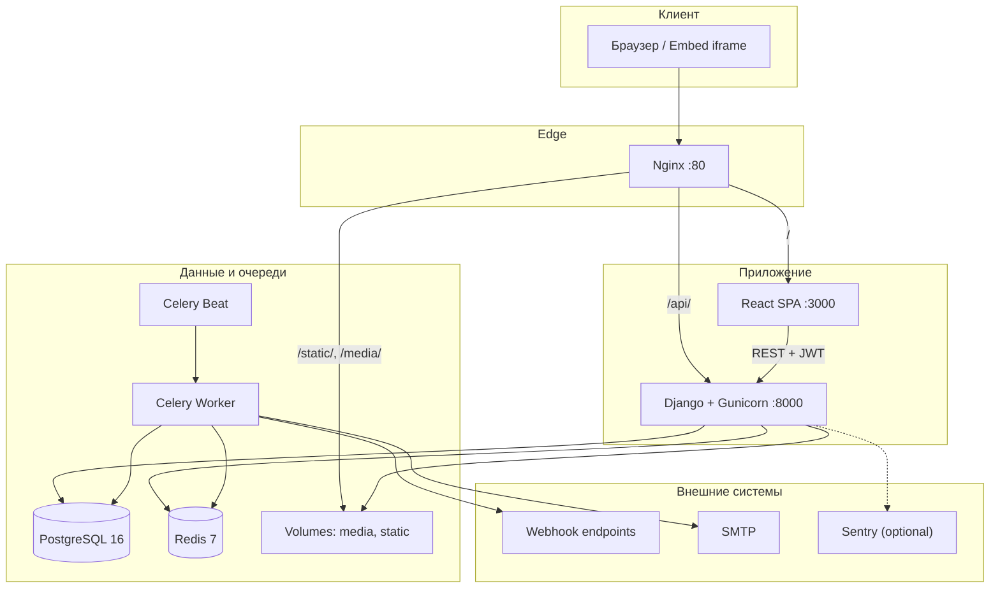

<div align="center">

# FormCraft

**Профессиональная SaaS-платформа для создания, публикации и анализа интерактивных форм — ваш Typeform / Google Forms под полным контролем.**

[](https://www.python.org/)
[](https://www.djangoproject.com/)
[](https://www.django-rest-framework.org/)
[](https://react.dev/)
[](https://www.typescriptlang.org/)
[](https://vitejs.dev/)

[](https://www.postgresql.org/)
[](https://redis.io/)
[](https://docs.celeryq.dev/)
[](https://docs.docker.com/compose/)
[](https://nginx.org/)

[](LICENSE)

</div>

---

## Содержание

1. [О проекте](#1-о-проекте)
2. [Ключевые возможности](#2-ключевые-возможности)
3. [Технологический стек](#3-технологический-стек)
4. [Структура репозитория](#4-структура-репозитория)
5. [Архитектура и как это работает](#5-архитектура-и-как-это-работает)
6. [Доменная модель (крупными блоками)](#6-доменная-модель-крупными-блоками)
7. [Сервисы в Docker Compose](#7-сервисы-в-docker-compose)
8. [Быстрый старт (локально, Docker)](#8-быстрый-старт-локально-docker)
9. [Основные команды Docker Compose](#9-основные-команды-docker-compose)
10. [Ручной запуск frontend и backend](#10-ручной-запуск-frontend-и-backend)
11. [Конфигурация и переменные окружения](#11-конфигурация-и-переменные-окружения)
12. [API, очереди и интеграции](#12-api-очереди-и-интеграции)
13. [Мониторинг и эксплуатация](#13-мониторинг-и-эксплуатация)
14. [Тестирование](#14-тестирование)
15. [Безопасность и хранение файлов](#15-безопасность-и-хранение-файлов)
16. [Роли компонентов в продакшене](#16-роли-компонентов-в-продакшене)
17. [Лицензия](#17-лицензия)
18. [Поддержка](#18-поддержка)

---

## 1. О проекте

**FormCraft** — production-ready платформа для визуального конструирования форм с drag-and-drop редактором, условной логикой, аналитикой воронки, управлением ответами, вебхуками и встраиванием на сторонние сайты. Проект ориентирован на команды, агентства и продуктовые компании, которым нужен собственный form-builder без привязки к закрытым облачным SaaS.

### Какой это тип системы

| Аспект | Описание |
|--------|----------|
| **Продукт** | B2B/B2C SaaS: конструктор форм, публичные ссылки, сбор ответов, экспорт, шаблоны |
| **Мультитенантность** | Workspaces с ролями (Owner / Admin / Editor / Viewer) и тарифами Free / Pro / Enterprise |
| **Архитектура** | Многосервисная: Django REST API + React SPA + Celery workers + Nginx reverse proxy |
| **Данные** | PostgreSQL (метаданные, ответы, аналитика) + Redis (кэш, брокер Celery) + volume для media/static |
| **Аутентификация** | JWT (access + refresh с ротацией), email как основной идентификатор пользователя |
| **Аналоги** | Typeform, Google Forms, Tally, Jotform — с акцентом на self-hosted и кастомизацию |

FormCraft не является «демо на выходные»: в репозитории заложены throttling API, HMAC-подпись вебхуков, снимки аналитики по расписанию, частичные отправки, лимиты тарифов и production-настройки безопасности.

---

## 2. Ключевые возможности

### Конструктор форм

- **Визуальный редактор** — палитра полей, холст сборки, панель свойств; состояние редактора в Zustand.
- **17+ типов полей** — текст, email, number, textarea, select, multi-select, radio, checkbox, date, time, file upload, rating, scale, heading, paragraph, divider, hidden.
- **Многостраничные формы** — поле `page` у каждого `FormField`.
- **Брендинг** — primary/background цвета, обложка, текст кнопки отправки, success message, redirect URL.
- **Условная логика** — show / hide / skip_to по операторам equals, contains, greater_than, is_empty и др.

### Ответы и интеграции

- **Submission management** — таблица ответов, детальный просмотр, статусы complete / partial / spam.
- **Экспорт CSV** — выгрузка ответов по форме.
- **Вебхуки** — POST с HMAC-подписью `X-FormCraft-Signature`, журнал доставок, автоотключение после 10 сбоев.
- **Интеграции** — Slack, Zapier, Google Sheets, Mailchimp, HubSpot, Airtable, Notion (модель + field mapping).
- **Встраивание** — whitelist доменов в `FormSettings.embed_allowed_domains`, custom CSS/JS.

### Аналитика

- Просмотры формы (`FormView`) с device/browser/geo.
- Дневные снимки (`FormAnalyticsSnapshot`): views, completion rate, avg duration, top referrers/countries.
- Drop-off по полям (`FieldDropoff`) для оптимизации воронки.

### Шаблоны и тарифы

- Каталог шаблонов по категориям с JSON-структурой формы.
- Планы **Free / Pro / Enterprise** с лимитами форм, ответов в месяц, размера файлов и флагами webhooks/analytics.

---

## 3. Технологический стек

| Слой | Технологии | Назначение |
|------|------------|------------|
| **Backend API** | Django 5.1, DRF 3.15, SimpleJWT | REST API, auth, ORM |
| **Frontend** | React 18, TypeScript 5, Vite 5, Tailwind 3, Zustand 4, Axios | SPA, конструктор, дашборд |
| **База данных** | PostgreSQL 16 | Транзакционные данные |
| **Кэш / брокер** | Redis 7 | Django cache + Celery broker (DB 0 / 1) |
| **Очереди** | Celery 5.4, django-celery-beat | Вебхуки, email, аналитические снимки |
| **Прокси** | Nginx Alpine | Единая точка входа, static/media, gzip, security headers |
| **Контейнеризация** | Docker Compose 3.9 | Локальный и prod-like стенд |
| **Наблюдаемость** | Sentry SDK (опционально) | Ошибки Django + Celery в production |
| **Файлы** | Pillow, django-storages + boto3 (опционально S3) | Загрузки и object storage |

---

## 4. Структура репозитория

```
FormCraft/
├── backend/
│   ├── config/                 # settings (base/dev/prod), urls, wsgi, celery
│   ├── apps/
│   │   ├── accounts/           # User, Workspace, Plan, роли
│   │   ├── forms/              # Form, FormField, ConditionalRule, FormSettings
│   │   ├── submissions/        # Submission, SubmissionAnswer, FileUpload
│   │   ├── templates_lib/      # FormTemplate, TemplateCategory
│   │   ├── analytics/          # FormView, snapshots, drop-off
│   │   └── integrations/       # Webhook, WebhookDelivery, Integration
│   ├── utils/                  # pagination, exception handler
│   ├── tests/                  # unit-тесты приложений
│   ├── requirements.txt
│   └── Dockerfile
├── frontend/
│   ├── src/
│   │   ├── api/                # Axios-клиенты (forms, submissions, analytics)
│   │   ├── components/         # FormBuilder, FieldComponents, layout, auth
│   │   ├── pages/              # Dashboard, FormBuilder, PublicForm
│   │   ├── store/              # authStore, formBuilderStore (Zustand)
│   │   ├── hooks/              # useFormBuilder, useSubmissions, useAnalytics
│   │   └── utils/              # fieldTypes, validation
│   ├── package.json
│   └── Dockerfile
├── nginx/
│   └── nginx.conf              # reverse proxy, /api, /static, /media
├── docker-compose.yml
├── .env.example
└── README.md
```

---

## 5. Архитектура и как это работает

### Общая схема



### Типовые сценарии

| Сценарий | Поток |
|----------|-------|
| **Создание формы** | SPA → `POST /api/forms/` → PostgreSQL; поля и правила — вложенные endpoints |
| **Публикация** | `status=published` → публичный slug → `GET /api/forms/{slug}/public/` без auth |
| **Отправка ответа** | Public POST → Submission + Answers → Celery: webhooks + email |
| **Аналитика** | `POST track-view` → FormView; Beat → daily snapshot в FormAnalyticsSnapshot |
| **Вебхук** | `send_webhook_notifications` → HMAC → WebhookDelivery log → retry до 3 раз |

---

## 6. Доменная модель (крупными блоками)

### Accounts — пользователи и рабочие пространства

| Сущность | Суть |
|----------|------|
| `User` | Email-auth, UUID PK, avatar |
| `Plan` | tier, лимиты форм/ответов, webhooks, analytics, branding |
| `Workspace` | slug, owner, members через `WorkspaceMembership` |
| `WorkspaceMembership` | role: owner / admin / editor / viewer |

### Forms — конструктор

| Сущность | Суть |
|----------|------|
| `Form` | title, slug, status, branding, multi-page, лимиты закрытия |
| `FormField` | field_type, validation, config JSON, order/page |
| `FieldOption` | варианты для select/radio/checkbox |
| `ConditionalRule` | show/hide/skip_to от source_field |
| `FormSettings` | email-уведомления, embed domains, GA/FB pixel, custom CSS/JS |

### Submissions — ответы

| Сущность | Суть |
|----------|------|
| `Submission` | form, respondent, IP/UA, duration, metadata |
| `SubmissionAnswer` | value + optional FileUpload |
| `FileUpload` | binary в `media/uploads/`, size, content_type |

### Analytics — метрики

| Сущность | Суть |
|----------|------|
| `FormView` | просмотр с device/geo/referrer |
| `FormAnalyticsSnapshot` | агрегат за день (unique views, completion rate) |
| `FieldDropoff` | отвал на поле по дате |

### Integrations — автоматизация

| Сущность | Суть |
|----------|------|
| `Webhook` | URL, secret, events[], failure_count |
| `WebhookDelivery` | payload, status, success |
| `Integration` | provider + config + field_mapping |

### Templates — каталог

| Сущность | Суть |
|----------|------|
| `TemplateCategory` | категории с иконкой и порядком |
| `FormTemplate` | `form_data` JSON, featured, use_count |

---

## 7. Сервисы в Docker Compose

| Сервис | Образ / сборка | Порт | Роль |
|--------|----------------|------|------|
| `db` | postgres:16-alpine | 5432 | Основная БД, healthcheck `pg_isready` |
| `redis` | redis:7-alpine | 6379 | Cache + Celery broker |
| `backend` | `./backend` Dockerfile | 8000 | migrate → collectstatic → **Gunicorn** (4 workers) |
| `celery_worker` | тот же образ | — | Асинхронные задачи (concurrency=4) |
| `celery_beat` | тот же образ | — | Периодика (DatabaseScheduler) |
| `frontend` | `./frontend` Dockerfile | 3000 | React dev/build сервер |
| `nginx` | nginx:alpine | **80** | Единый вход: SPA + API + static/media |

**Volumes:** `postgres_data`, `redis_data`, `media_data`, `static_data`.

---

## 8. Быстрый старт (локально, Docker)

### Требования

- Docker Engine 24+ и Docker Compose V2
- 4 GB RAM (рекомендуется для одновременного старта всех сервисов)
- Порты **80**, **5432**, **6379** свободны (или измените mapping в `docker-compose.yml`)

### Шаг 1 — клонирование и конфигурация

```bash
git clone https://github.com/NodirOdilov/FormCraft.git
cd FormCraft
cp .env.example .env
```

Отредактируйте `.env`: задайте надёжный `DJANGO_SECRET_KEY`, пароль PostgreSQL и при необходимости SMTP.

### Шаг 2 — запуск стека

```bash
docker compose up --build -d
```

### Шаг 3 — суперпользователь

```bash
docker compose exec backend python manage.py createsuperuser
```

### Шаг 4 — проверка

| Сервис | URL |
|--------|-----|
| **Frontend (через Nginx)** | http://localhost |
| **REST API** | http://localhost/api/ |
| **Django Admin** | http://localhost/api/admin/ |
| **Backend напрямую** | http://localhost:8000 (только при отладке) |

Миграции выполняются автоматически при старте `backend`. При необходимости вручную:

```bash
docker compose exec backend python manage.py migrate
```

---

## 9. Основные команды Docker Compose

| Команда | Назначение |
|---------|------------|
| `docker compose up --build` | Сборка и запуск всех сервисов (foreground) |
| `docker compose up -d` | Запуск в фоне |
| `docker compose down` | Остановка контейнеров |
| `docker compose down -v` | Остановка + **удаление volumes** (очистка БД и media) |
| `docker compose logs -f backend` | Логи API |
| `docker compose logs -f celery_worker` | Логи воркера |
| `docker compose exec backend python manage.py shell` | Django shell |
| `docker compose exec backend python manage.py createsuperuser` | Админ-пользователь |
| `docker compose exec backend python manage.py test` | Запуск тестов |
| `docker compose restart nginx` | Перезагрузка прокси после смены конфига |

---

## 10. Ручной запуск frontend и backend

Удобно для разработки без полного Docker-стека (нужны локальные PostgreSQL и Redis).

### Backend

```bash
cd backend
python -m venv venv

# Windows
venv\Scripts\activate
# Linux / macOS
source venv/bin/activate

pip install -r requirements.txt
set DJANGO_SETTINGS_MODULE=config.settings.development   # Windows
# export DJANGO_SETTINGS_MODULE=config.settings.development

python manage.py migrate
python manage.py runserver
```

### Celery (отдельные терминалы)

```bash
cd backend
celery -A config worker -l info
celery -A config beat -l info
```

### Frontend

```bash
cd frontend
npm install
npm run dev
```

По умолчанию API: `REACT_APP_API_URL=http://localhost/api` (через Nginx) или `http://127.0.0.1:8000/api` при прямом доступе к Django.

| npm script | Действие |
|------------|----------|
| `npm run dev` | Vite dev server |
| `npm run build` | Production build (`tsc && vite build`) |
| `npm run preview` | Превью production-сборки |
| `npm run lint` | ESLint для TS/TSX |

---

## 11. Конфигурация и переменные окружения

Полный шаблон — в [`.env.example`](.env.example).

| Переменная | Описание | По умолчанию |
|------------|----------|--------------|
| `DJANGO_SECRET_KEY` | Секрет Django | *(обязательно сменить)* |
| `DJANGO_DEBUG` | Режим отладки | `True` |
| `DJANGO_ALLOWED_HOSTS` | Разрешённые хосты | `localhost,127.0.0.1` |
| `DJANGO_SETTINGS_MODULE` | Модуль настроек | `config.settings.development` |
| `DATABASE_URL` | PostgreSQL DSN | из POSTGRES_* |
| `REDIS_URL` | Redis для cache | `redis://redis:6379/0` |
| `CELERY_BROKER_URL` | Брокер Celery | `redis://redis:6379/1` |
| `CORS_ALLOWED_ORIGINS` | CORS для SPA | `http://localhost:3000,http://localhost` |
| `JWT_ACCESS_TOKEN_LIFETIME_MINUTES` | TTL access token | `60` |
| `JWT_REFRESH_TOKEN_LIFETIME_DAYS` | TTL refresh token | `7` |
| `MAX_UPLOAD_SIZE_MB` | Лимит загрузки файлов | `10` |
| `EMAIL_*` | SMTP для уведомлений | console backend в dev |
| `SENTRY_DSN` | Sentry (production) | пусто |
| `REACT_APP_API_URL` | Base URL API для фронта | `http://localhost/api` |

**Production:** установите `DJANGO_SETTINGS_MODULE=config.settings.production`, `DJANGO_DEBUG=False`, включите HTTPS (`SECURE_SSL_REDIRECT`), задайте `SENTRY_DSN`.

---

## 12. API, очереди и интеграции

### REST API (префикс `/api/`)

#### Аутентификация — `/api/auth/`

| Метод | Endpoint | Описание |
|-------|----------|----------|
| `POST` | `/register/` | Регистрация |
| `POST` | `/login/` | JWT access + refresh |
| `POST` | `/refresh/` | Обновление access token |

#### Формы — `/api/forms/`

| Метод | Endpoint | Описание |
|-------|----------|----------|
| `GET/POST` | `/` | Список / создание |
| `GET/PUT/PATCH/DELETE` | `/{id}/` | CRUD формы |
| `POST` | `/{id}/duplicate/` | Дублирование |
| `GET` | `/{slug}/public/` | Публичная форма (без auth) |
| `*` | `/{form_pk}/fields/` | Поля формы |
| `*` | `/{form_pk}/rules/` | Условные правила |

#### Ответы — `/api/submissions/`

| Метод | Endpoint | Описание |
|-------|----------|----------|
| `GET` | `/?form={id}` | Список ответов |
| `POST` | `/` | Создание (публичное) |
| `GET` | `/{id}/` | Детали ответа |
| `GET` | `/export/?form={id}` | Экспорт CSV |

#### Аналитика — `/api/analytics/`

| Метод | Endpoint | Описание |
|-------|----------|----------|
| `GET` | `/{form_id}/` | Метрики формы |
| `POST` | `/track-view/` | Трекинг просмотра |

#### Шаблоны — `/api/templates/`

| Метод | Endpoint | Описание |
|-------|----------|----------|
| `GET` | `/` | Каталог шаблонов |
| `POST` | `/{id}/use/` | Создать форму из шаблона |

#### Интеграции — `/api/integrations/`

| Метод | Endpoint | Описание |
|-------|----------|----------|
| `GET/POST` | `/webhooks/` | CRUD вебхуков |
| `POST` | `/webhooks/{id}/test/` | Тестовая отправка |

### Celery-задачи

| Задача | Модуль | Назначение |
|--------|--------|------------|
| `send_webhook_notifications` | submissions | POST на вебхуки с HMAC, retry ×3 |
| `send_submission_notification_email` | submissions | Email владельцу формы |
| `generate_all_daily_snapshots` | analytics | Снимки за вчера (Beat) |
| `generate_single_form_snapshot` | analytics | Ручной/backfill снимок |

### Throttling API

- Анонимные: **100 req/hour**
- Авторизованные: **1000 req/hour**

---

## 13. Мониторинг и эксплуатация

| Компонент | Рекомендация |
|-----------|--------------|
| **Логи Django** | `docker compose logs -f backend`; в production — файл `logs/formcraft.log` |
| **Celery** | Мониторинг очереди Redis, логи worker/beat |
| **PostgreSQL** | Регулярные бэкапы volume `postgres_data` |
| **Redis** | Персистентность volume `redis_data` при необходимости |
| **Sentry** | `SENTRY_DSN` + `config.settings.production` |
| **Healthchecks** | `db` и `redis` в compose — `depends_on: condition: service_healthy` |
| **Nginx** | gzip, `client_max_body_size 20M`, security headers |

---

## 14. Тестирование

Тесты расположены в `backend/tests/`:

```bash
# В Docker
docker compose exec backend python manage.py test

# Локально
cd backend
python manage.py test
```

| Модуль | Покрытие |
|--------|----------|
| `test_forms.py` | CRUD форм, поля, публикация |
| `test_submissions.py` | Создание ответов, валидация |
| `test_analytics.py` | Снимки, трекинг просмотров |
| `test_integrations.py` | Вебхуки (mock HTTP) |

---

## 15. Безопасность и хранение файлов

| Область | Реализация |
|---------|------------|
| **Auth** | JWT + rotate refresh + blacklist |
| **API** | DRF permissions, custom exception handler, rate limits |
| **Вебхуки** | HMAC-SHA256 заголовок `X-FormCraft-Signature` |
| **Uploads** | `MAX_UPLOAD_SIZE_MB`, валидация на уровне полей |
| **Media** | `/media/` через Nginx; в prod — S3 через django-storages (boto3 в зависимостях) |
| **Static** | WhiteNoise + `collectstatic` + Nginx cache 30d |
| **Production** | HSTS, secure cookies, `X_FRAME_OPTIONS=DENY`, SSL redirect |
| **Embed** | Whitelist доменов в `FormSettings` |

**Рекомендации для prod:** отдельный секрет для каждого окружения, HTTPS-only cookies, ограничение `CORS_ALLOWED_ORIGINS`, регулярная ротация webhook secrets.

---

## 16. Роли компонентов в продакшене

| Компонент | Роль |
|-----------|------|
| **Nginx** | TLS termination (вне compose), балансировка, static/media, единый домен |
| **Gunicorn** | WSGI, несколько workers, timeout 120s для тяжёлых запросов |
| **Celery Worker** | Изоляция I/O: webhooks, email, не блокирует API |
| **Celery Beat** | Cron-аналог для daily analytics snapshots |
| **PostgreSQL** | Source of truth; connection pooling через `conn_max_age=600` |
| **Redis** | Cache hot paths + broker; разделение DB 0/1 |
| **React build** | `npm run build` → статика за Nginx (вместо dev-server) |

Типовой деплой: один VPS / Kubernetes namespace, внешний managed PostgreSQL, Redis Sentinel или ElastiCache, object storage для media, CDN для static.

---

## 17. Лицензия

Проект распространяется под лицензией **MIT**. Подробности — в файле [LICENSE](LICENSE).

---

## 18. Поддержка

- **Issues:** [GitHub Issues](https://github.com/NodirOdilov/FormCraft/issues) — баги, feature requests, вопросы по развёртыванию
- **Документация API:** Django Admin + OpenAPI (при добавлении drf-spectacular — расширяемо)
- **Contributing:** fork → feature branch → PR с описанием изменений и шагами проверки

---

<div align="center">

**FormCraft** — создавайте формы, которые конвертируют.  
*Сделано с вниманием к архитектуре, DX и production-ready эксплуатации.*

</div>
